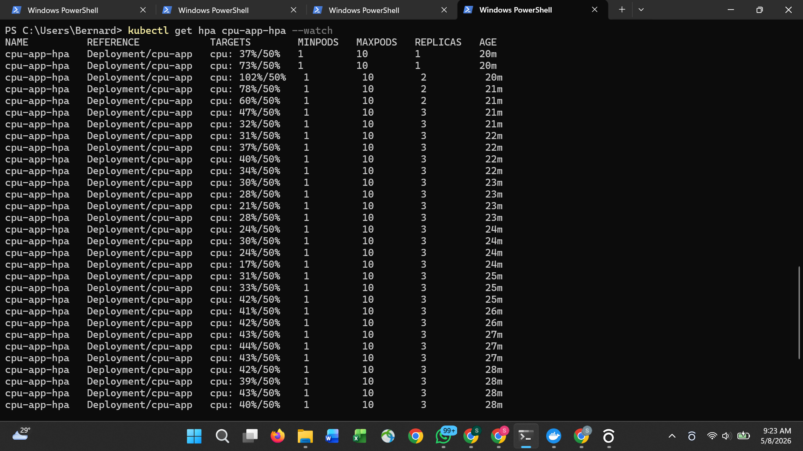
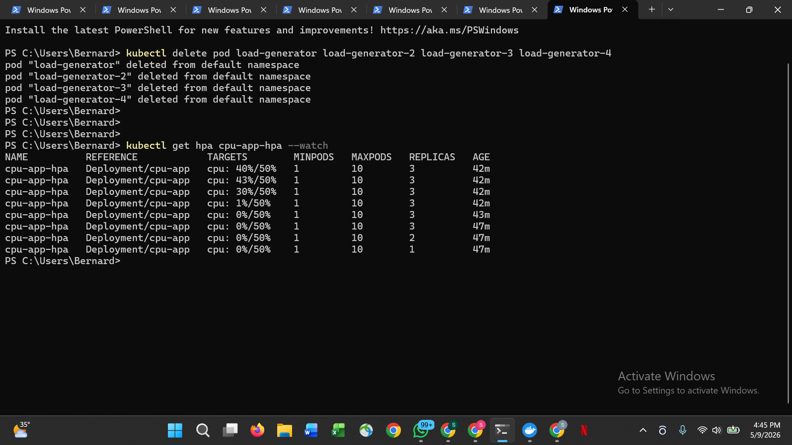

# Kubernetes Horizontal Pod Autoscaler

Automatic pod scaling based on CPU utilisation. When load increases pods
scale out automatically. When load drops pods scale back in. Zero manual
intervention required.

## What was proved

| Phase | CPU | Replicas |
|---|---|---|
| Baseline | 0% | 1 |
| Load applied (1 generator) | 42% | 1 |
| Load increased (4 generators) | 102% | 2 |
| HPA stabilised | 40% | 3 |
| Load removed | 0% | 3 |
| Scale-down (5 min cooldown) | 0% | 1 |

## HPA configuration

- Minimum replicas: 1
- Maximum replicas: 10
- Scale-up threshold: CPU > 50% average utilisation
- Scale-down cooldown: 5 minutes

## Evidence

### HPA scaling up — CPU exceeded 50%

### HPA scaling down — load removed

## Project structure

manifests/cpu-app.yaml   -- Deployment with CPU requests and limits
manifests/hpa.yaml       -- HorizontalPodAutoscaler definition

## Key concepts demonstrated

Resource requests -- CPU requests are required for HPA to work. Without them
the metrics server cannot calculate utilisation percentage.

Scale-up behaviour -- HPA checks metrics every 15 seconds and scales up
immediately when threshold is breached.

Scale-down cooldown -- HPA waits 5 minutes before scaling down to prevent
thrashing during brief traffic dips.

Ceiling -- maxReplicas: 10 prevents runaway scaling from consuming all
cluster resources during a traffic spike or infinite loop.

## Stack

Kubernetes, HPA, Metrics Server, Docker Desktop, curlimages/curl

## What I would add next

- Vertical Pod Autoscaler to right-size CPU and memory requests
- Cluster Autoscaler on EKS or AKS to add nodes when pods are unschedulable
- Custom metrics HPA using Prometheus adapter -- scale on request rate not CPU
- KEDA for event-driven autoscaling (scale on queue depth, Kafka lag, etc)
